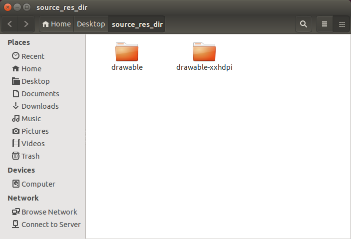
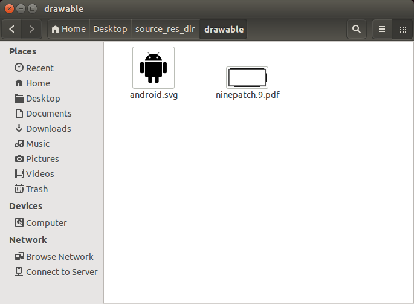
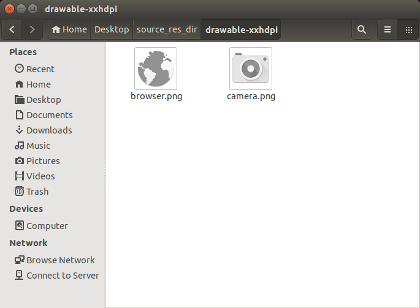
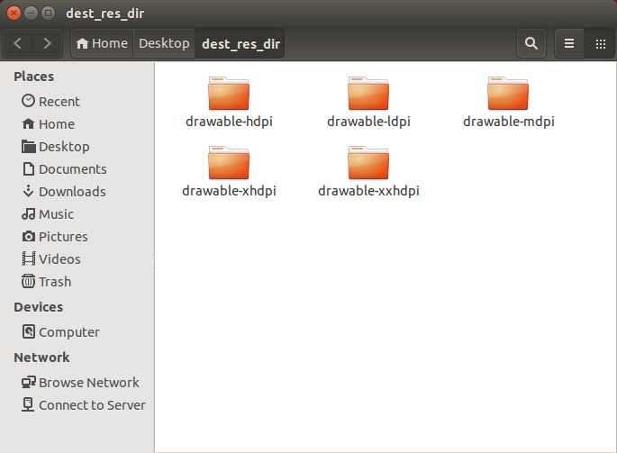
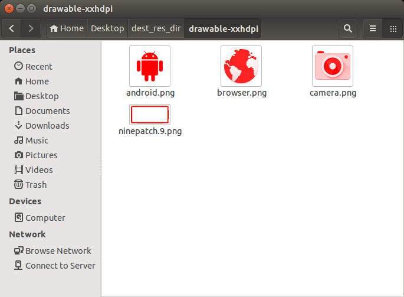

************************************************************************************
Sorolla: Image scaling, tinting & coloring utilities optimized for Android resources
************************************************************************************
**Sorolla** is a simple Python package that provides an easy way to scale, tint and color-fill any kind of image.

It is especially designed for Android resources, giving support to Android standard and Nine-patch resources while keeping their properties. It also supports vector resources, such as .pdf and .svg. 

The library also detects if the resource contains the nine-patch resource notation (.9.<file_extension>) in its file name so it can work with it while keeping the nine-patch's properties.

.. contents::
    :local:
    :depth: 1
    :backlinks: none

=============================
Requirements and installation
=============================
In order to use *Sorolla* you need the following programs installed in your system:

- Python 2.7.x
- `ImageMagick <http://www.imagemagick.org/>`_ and `GhostScript <http://www.ghostscript.com/>`_ installed in the system and available from PATH. Install them from a package management tool or build them from source.

The package has been tested in *Ubuntu 14.04, Windows 8.1 & Mac OS X 10.10*

If you want to install the package in your current Python instance run:

.. code-block:: bash

    $ python setup.py install

or:

.. code-block:: bash

    $ python setup.py develop

if you want to install the library for debugging or testing purposes.

You can also import the library from the *sorolla* folder and use it directly in your custom scripts.

==========
How to use
==========
Just import the *Sorolla* class from the *sorolla* package in your Python script.

.. code-block:: python

    from sorolla import Sorolla

The *Sorolla* class exposes the following *static methods*:

    **Sorolla.color_resource(source_file, dest_file, fill_color)**

    Colors a raster resource; detects if it's a nine-patch via filename in order to color it properly
     
    Arguments:
        *source_file*   Source file to color. Path can be relative or absolute

        *dest_file* Destination file where the colored file will be saved. Path can be relative or absolute

        *fill_color*    Color to fill the resource. Must be a RRGGBB string.
     
    Returns:
        Whether the action could be run or not

    **Sorolla.scale_resource(source_file, dest_file, scale)**

    Scales a resource; detects if it's a nine-patch via filename in order to scale it properly
     
    Arguments:
        *source_file*   Source file to convert. Path can be relative or absolute

        *dest_file* Destination file where the converted file will be saved. Path can be relative or absolute

        *scale* Scale value as a float. If it's greater than zero, the function upscales the image; if less than zero, it downscales the image
     
    Returns:
        Whether the action could be run or not

    **Sorolla.tint_resource(source_file, dest_file, tint_color)**

    Tints a gray-scaled raster resource; detects if it's a nine-patch via filename in order to tint it properly
     
    Arguments:
        *source_file*   Source file to tint. Path can be relative or absolute

        *dest_file* Destination file where the tinted file will be saved. Path can be relative or absolute

        *fill_color*    Color to tint the resource. Must be a RRGGBB string.
     
    Returns:
        Whether the action could be run or not

========
Examples
========

You can find an usage example in `example.py <example.py>`_ script.

The script acccepts the following syntax:

.. code-block:: bash

    $ python example.py source_res_dir dest_res_dir rgb_hex_color_without_#

This script takes a source folder containing:

- A *drawable* folder which contains assets (preferrably .pdf or .svg) that need to be scaled & colored for all of Android's screen pixel densities, using *mdpi* scale as a base. (in our use-case, pure black resources)
- A number of *drawable-<dpi>* folders which need to be tinted (in our use-case, gray-scale & pre-resized nine-patch resources)

and saves the results in another folder ready to import them into an Android project.

*Note: the script skips xxxhdpi resource generation, see* `this excerpt from Android documentation <http://developer.android.com/guide/practices/screens_support.html#xxxhdpi-note>`_ *for more details.*

Suppose that we have the following folders in "source_res_dir":

If the following command is issued:

.. code-block:: bash

    $ python example.py source_res_dir dest_res_dir FF0000

We'll get the following result:

(Contents in the rest of folders have been skipped)

=======
License
=======

This project is licensed under the Apache Software License, Version 2.0.

.. code::

    Copyright (c) 2015 bq

    Licensed under the Apache License, Version 2.0 (the "License");
    you may not use this file except in compliance with the License.
    You may obtain a copy of the License at

       http://www.apache.org/licenses/LICENSE-2.0

    Unless required by applicable law or agreed to in writing, software
    distributed under the License is distributed on an "AS IS" BASIS,
    WITHOUT WARRANTIES OR CONDITIONS OF ANY KIND, either express or implied.
    See the License for the specific language governing permissions and
    limitations under the License.